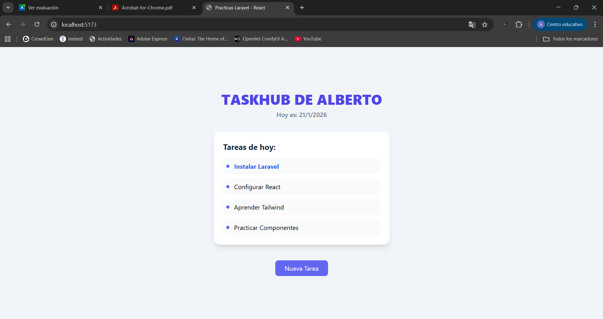

# Documentación de Prácticas: TaskHub (Laravel + React)

Este repositorio contiene el desarrollo progresivo de las actividades de clase para la creación de **TaskHub**.



## Estructura del Repositorio
El repositorio se divide en tres secciones claras, que representan la evolución del aprendizaje:

1.  **Carpeta `act1/`**: Primera iteración (Dinámica básica).
2.  **Carpeta `act2/`**: Segunda iteración (Refuerzo y reestructuración).
3.  **Carpeta `taskhub/`**: **PROYECTO FINAL** en Laravel Framework.

---

## 1. Actividad 1 (`act1`)
*Objetivo: Introducción a la sintaxis JSX y dinamismo básico.*

En esta carpeta se encuentra el archivo `Welcome.jsx` original modificado.
-   **Cambios realizados**:
    -   Sustitución de HTML estático por variables `{nombreUsuario}`.
    -   Uso de `.map()` para listar tareas.
    -   Estilos condicionales (Azul si incluye "Laravel").

## 2. Actividad 2 (`act2`)
*Objetivo: Consolidación y Organización.*

Se replicó la lógica de la Actividad 1 en una estructura de carpetas independiente.
-   **Estado final**: El código es funcionalmente idéntico a la Actividad 1, pero organizado en su propio directorio para entrega separada.

---

## 3. Proyecto Final: TaskHub (Laravel)
*Carpeta: `taskhub/`*

Esta es la implementación **real y completa** utilizando el Framework Laravel, siguiendo todos los pasos oficiales del enunciado.

### Pasos de Instalación Realizados:

#### A. Preparación (Caja de Herramientas)
1.  **Base de Datos**: Se creó la base de datos `taskhub` en MySQL (XAMPP).
2.  **Composer**: Se verificó la instalación correcta de Composer.

#### B. Instalación (Frameworks)
Se ejecutaron los comandos profesionales para crear el proyecto e integrar React:
```bash
# 1. Crear proyecto Laravel
composer create-project laravel/laravel taskhub

# 2. Instalar la "brisa" (Breeze) para React
cd taskhub
composer require laravel/breeze --dev
php artisan breeze:install react
```

#### C. Configuración (Conexión de Cables)
Se editó el archivo `.env` dentro de `taskhub/` para conectar con la base de datos creada:
```env
DB_CONNECTION=mysql
DB_DATABASE=taskhub
DB_USERNAME=root
DB_PASSWORD=
```
Y se ejecutaron las migraciones: `php artisan migrate`.

#### D. Implementación del Código
Finalmente, se trasladó la lógica de la **Actividad 2** al corazón de Laravel:
-   **Archivo modificado**: `taskhub/resources/js/Pages/Welcome.jsx`.
-   Ahora, al ejecutar el proyecto Laravel, se visualiza nuestra interfaz personalizada de "Alberto" con las tareas dinámicas.

### Cómo ejecutar el Proyecto Laravel
Para ver la versión final, necesitas dos terminales dentro de la carpeta `taskhub`:

1.  **Backend**: `php artisan serve`
2.  **Frontend**: `npm run dev`

---
*Práctica realizada por Alberto.*
